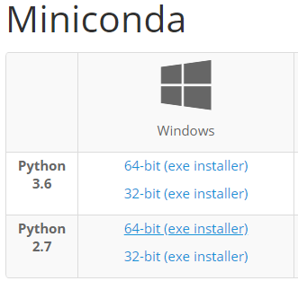
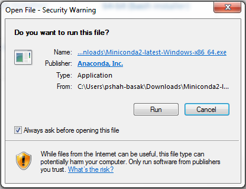
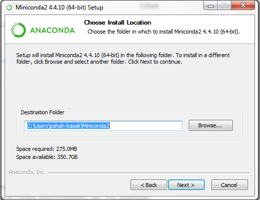
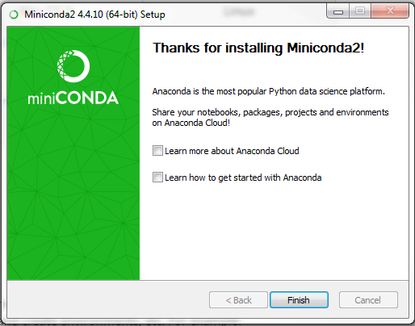
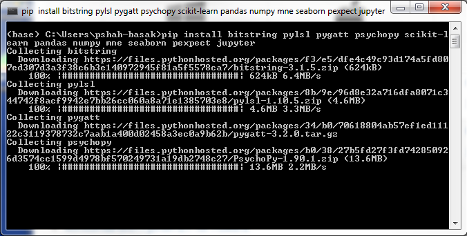

# muse-lsl + eeg-notebooks windows installation + setup instructions

## 1. Install miniconda

Miniconda is a 'mini' version of the anaconda python distribution.

Download the Windows miniconda installer from https://conda.io/miniconda.html (python 2.7 64-bit version)

Tip: you can check your windows operating system type in the Control Panel → System and Security → System

Run the installer and follow the steps below

Click Next

Click ‘I Agree’ 

Select ‘Just Me’ and click Next

Browse to the location where you want to install, or click Next to keep the default location (Tip: Make sure you have enough space available on your hard-drive for this installation) 

Once installation is complete, click Next

Click Finish

After the installation is complete, click on the Windows button and search for ‘Anaconda Prompt’ 
Tip: pin it to the Windows taskbar for easy access in the future

Click on Anaconda Prompt, which will bring up an anaconda terminal 

Create a conda environment for your neurobrite work:

`conda create -n “neurobrite”  python=2`

(You need to activate this environment every time you start a new terminal when you want to do work within the neurobrite environment we are about to setup)  

Activate the neurobrite conda environment and install the libraries

`conda activate neurobrite`

`conda install git` 

`pip install bitstring pylsl psychopy scikit-learn pandas numpy mne seaborn
pyriemann pexpect jupyter pyglet==1.2`

`pip install git+https://github.com/peplin/pygatt`

(this may take up to 5 minutes to install)

Next type `jupyter notebook password`

Enter a password of your choice

Tip: choose a password that you will remember! You will need it every time you want to use jupyter notebook.

## 2. (Optional) Download git bash for windows

Git bash gives you a linux-style terminal, as well as a git installation and a few other useful linuxy things.

You can download git bash from: https://git-scm.com/download/win

Run the installation with default settings

## 3. Get eeg-notebooks

You have two options, pick one from the following:

1) With git bash:

`Type git clone --recursive https://github.com/NeuroTechX/eeg-notebooks`

de

2) Without git bash:

Navigate to the github repository (or https://github.com/NeuroTechX/eeg-notebooks) directly in a web browser and download eeg-notebooks.

Now, you are ready to use the jupyter notebook.

## 4. Get familiar with EEG notebooks

Here are a few  the steps to get you started:

Start an anaconda terminal (follow the steps described earlier)

Type  `cd eeg-notebooks` to go in the folder that you have created

Type `jupyter notebook --no-browser`

Now select the URL with the token and copy it into a web browser 
Tip: You may need to enable ‘marking’ in your terminal to able to copy the URL

OR In a web browser, go to `localhost:8888`.

This should bring up the `eeg-notebooks` folder structure.

Go to the notebooks folder and open up `N170 with Muse.ipynb` to try, and working through the cells in this notebook.

*Tip: Hover over the icons inside the notebook to get more details on their functionality*

The top section of the notebook consists of details regarding the Muse experiment.

Select the cells sequentially starting from the top one and click on play button to run.

  
## 5. (Optional) Install BlueMuse

[BlueMuse](https://github.com/kowalej/BlueMuse) is a windows 10 program that allows communication between a `muse` headset and a computer's native bluetooth drivers using the `lsl` communication protocol. It can be used as an alternative to the `BLED112` dongle. 

To install, go the the [ `BlueMUSE` github website](https://github.com/kowalej/BlueMuse). Click `download` (green button, right hand corner). Once downloaded, unzip the download file. Navigate to `Dist` folder and unzip the latest distribution number (e.g. `BlueMuse_1.0.5.0.zip`. Once unzipped, go into this folder, and follow the [installation instructions](https://github.com/kowalej/BlueMuse#installation) in the website's `README.md` file. It is easiest to simple read these through github in a web browser. 

